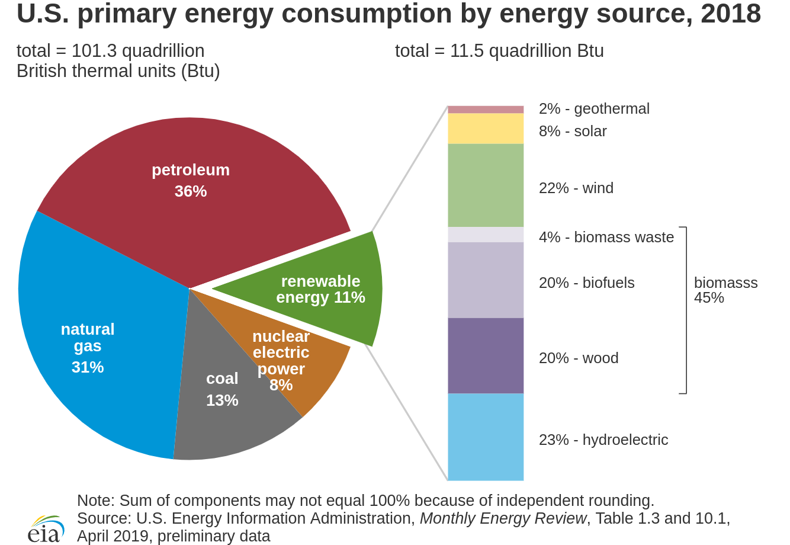
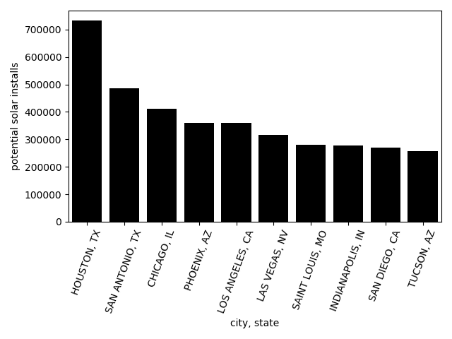
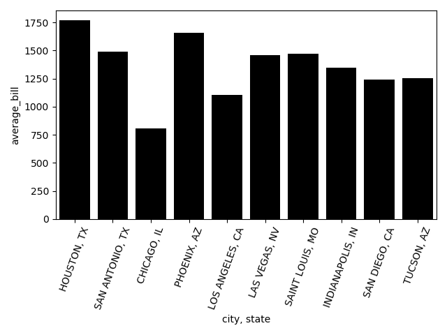
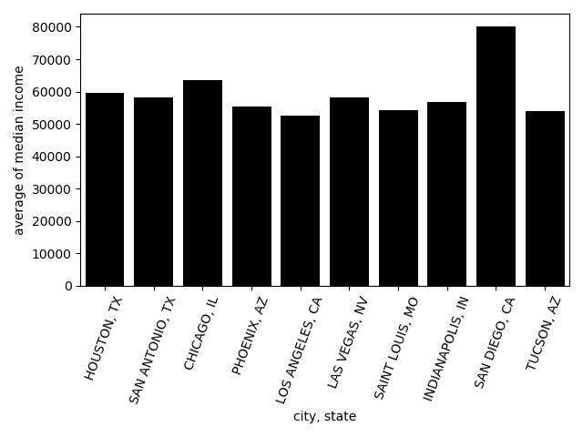
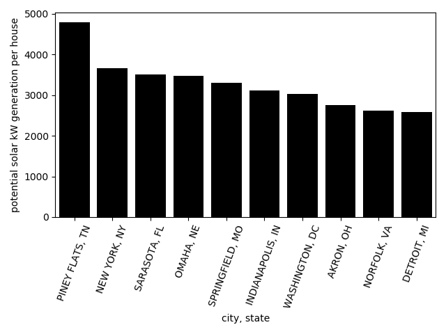
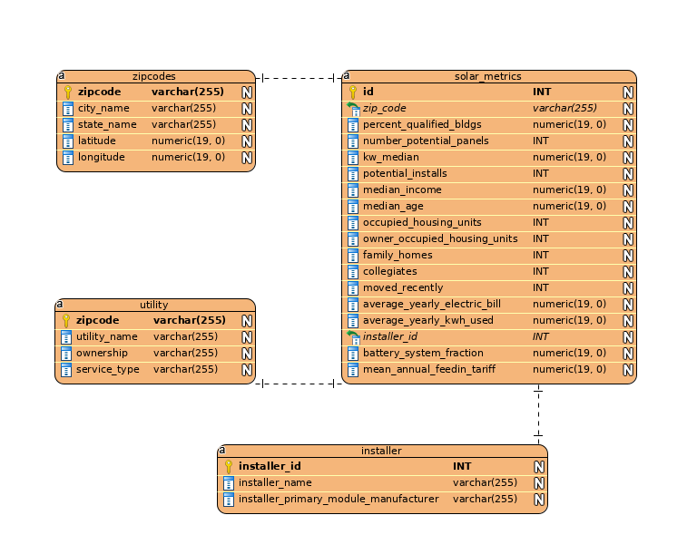

# Understanding Opportunities in the US Residential Solar Market
This is my capstone project for the data engineering nanodegree (DEND), where I combine several data sources to answer to question:  Which US locations should solar installers target in order to install as many solar panels as possible?

## The Capstone
The purpose of the Udacity DEND capstone is to bring together disparate data sources to create something useful, and to use techniques learned in the DEND.  After looking for a long time at the [Google](https://console.cloud.google.com/marketplace/browse?filter=solution-type:dataset) and [AWS](https://registry.opendata.aws/) datasets, I had my idea: combine census, electricity, and solar data to understand which US cities are best for solar installers to target.  If you are working on a data science or engineering project yourself, realize this took me several hours of searching public datasets and APIs to figure out this idea, so don't be discouraged if it takes you a while to come up with a good project idea.

## Motivation
I think most people would like clean energy to power our society, and the price of solar has decreased to the point where it's becoming [cheaper than conventional power sources in many places](https://e360.yale.edu/digest/renewables-cheaper-than-75-percent-of-u-s-coal-fleet-report-finds).  And since only about [2 million](https://www.seia.org/news/united-states-surpasses-2-million-solar-installations) out of the roughly [95 million single-family homes](https://www.quora.com/How-many-single-family-homes-are-there-in-the-US) have solar installed in the US, there's a massive opportunity for solar installers to bring solar power to US homes.  We can reduce pollution from coal and save people money on their electricity bill.  But which locations should solar installers target?  The primary aim of this project is to answer that question.

Only a small fraction of US electricity comes from solar, and about [38.5%](https://www.eia.gov/energyexplained/electricity/use-of-electricity.php) of electricity is used by residential customers in the US.  Solar installs are also [growing rapidly](https://www.seia.org/solar-industry-research-data), so the time looks ripe to be a residential solar installer.

Source: https://www.eia.gov/energyexplained/us-energy-facts/

## Some Analytics Results
After completing the database and ETL pipeline, I queried the data for a few results.  The queries are in the data_analysis.py file.

Which US cities have the top number of potential installs (from project sunroof data)?

Houston dominates this list.  However, the data may be limited because project sunroof's coverage may not be so great.  Further investigation into the number of homes and amount of missing data would be warranted before using this data to decide to target Houston.

Taking these top few cities, we can then see what their electric bills and income tend to look like.  The electric bills are high in Texas (due to air conditioning and refrigeration costs), again pointing to Texas being a good market.  The average of the median income by zip code for each city shows most cities are around the same median income, except San Diego is higher.

Lastly, I looked at which cities have the highest average potential for generating large amounts of electricity.  These tend to be cities in the south and midwest, although NYC is in there.  For the south/midwest cities, these are probably large homes on average due to cheap land and housing costs.  For cities like NYC and DC, it may be that there are large buildings like apartments or other buildings which are skewing the numbers.

## Background and Data Sources
There are about [300 US cities](https://en.wikipedia.org/wiki/List_of_United_States_cities_by_population) with populations of 100k or more, and solar installers probably don't have the resources to target all of them at once.  Even within a city, different areas may have much higher success rates for selling homeowners solar panels.  We need data that can help us decide which cities, and even locations within the cities (e.g. zipcodes), are best to target.

### Datasets
Thinking about the problem, we can quickly realize economics, demographics, and culture are going to play a big role in the success of residential solar installation.  Obviously people need to be able to afford it and people need to be amenable to installing solar cells on the home.  US Census data can help us understand the economics and possibly some of the sentiment towards solar via demographics (e.g. perhaps younger homeowners are more amenable to installing solar panels on their roof; more data analysis would have to be done to understand that).  People also need to have the economic incentive of saving money on their electric bill.  The other big factors are of course physics and potential roof space -- how much sunlight falls on a given area, and how many potential installs are there?

I chose a some relevant datasets for this project that give us the data we need.  As I continued through the project, I kept finding I needed more datasets.

| Name                                 | Abbreviation | Description                                                    | Purpose                                                             | Link                                                                                                                                                | Number of Rows | Format   |
|--------------------------------------|--------------|----------------------------------------------------------------|---------------------------------------------------------------------|-----------------------------------------------------------------------------------------------------------------------------------------------------|----------------|----------|
| US Census ACS                        | ACS          | Survey of US people.                                           | Demographics                                                        | [link](https://console.cloud.google.com/marketplace/details/united-states-census-bureau/acs?q=census%20acs&id=1282ab4c-78a4-4da5-8af8-cd693fe390ab) | 33,120         | BigQuery |
| Project Sunroof                      | sunroof      | Google's residential solar install data.                       | Solar irradiation and # installs by zipcode                         | [link](https://console.cloud.google.com/marketplace/details/project-sunroof/project-sunroof)                                                        | 11,516         | BigQuery |
| LBNL Tracking the Sun                | LBNL         | LBNL installed solar system data.                              | Number of and installer for residential solar installs.             | [link](https://emp.lbl.gov/tracking-the-sun/)                                                                                                       | 1,543,831      | CSV      |
| EIA-861 Report                       | EIA861       | U.S. Energy Information Administration energy use report.      | Amount and price of residential energy used.                        | [link](https://www.eia.gov/electricity/data/eia861/)                                                                                                | 3,436          | XLSX     |
| EIA IOU/Non-IOU Rates with Zip Codes | EIArates     | Utility company to zip code lookup.                            | Combine with EIA-861 to get zip codes of energy prices and amounts. | [link](https://openei.org/doe-opendata/dataset/u-s-electric-utility-companies-and-rates-look-up-by-zipcode-2017)                                    | 86,672         | CSV      |
| Zipcode                              | zipcode      | Zipcodes with associated city, state, latitude, and longitude. | Used as a dimension table for dimensions for zipcodes.              | [link](http://federalgovernmentzipcodes.us/download.html)                                                                                           | 42,522         | CSV      |

Other potential datasets include [NREL's National Solar Radiation Database](https://registry.opendata.aws/nrel-pds-nsrdb/) for more data on solar energy potential, social media sources including Facebook, Reddit, and Twitter, to understand sentiment towards residential solar installs, and survey data (such as [Pew Center data](https://www.pewresearch.org/fact-tank/2016/10/05/americans-strongly-favor-expanding-solar-power-to-help-address-costs-and-environmental-concerns/)) to understand sentiment towards solar installs.  [RECS](https://www.eia.gov/consumption/residential/data/2015/index.php) also has more data on existing solar installs and demographics.  Since including these sources (especially social media) would require a great deal more of work, I have not done so yet.

Something else I would like to add (that would be relatively easy) would be population by zipcode, which would help understand how much total power certain areas may be using.

## Data Model
I chose the classic star schema as a data model for our database.  We have a central fact table which gives us numbers on the things we want to know:

- How many potential solar installs?
- How much solar power could be generated?
- How much money do people have available?
- How much money will people save?
- Where is the least competition?

The ERD for the DB schema is shown below.  It is saved as ERD.xml for the [wwwsqldesigner](https://github.com/ondras/wwwsqldesigner).

The data dictionary can be found in the data_dictionary.xlsx file.

The central table is the solar_metrics table (each row is data for a given zip code) which includes data from project sunroof, the US census ACS survey, the LBNL solar installs survey, and data from the EIA-861 report on how much energy is used by consumers in different zip codes.

The ancillery dimension tables include a zipcode table with city, state, and lat/lng for zipcodes, a utility table with details about each utility company, and an installer table with details about each installer (e.g. the main module manufacturer each installer uses).

To expand, I would add another fact table (making the schema a galaxy schema) with installation data from the LBNL dataset.  This would enable looking at which areas have growing competition from other companies.  The table would have at least:
- primary key id
- Zip Code
- Feed-in Tariff (Annual Payment)
- Feed-in Tariff (Duration)
- Module Model ID
- Manufacturer ID
- Module Efficiency
- Installer ID

Then we would also need another dimension table:
- module manufacturer table: manufacturer code, manufacturer name

One further expansion of the database would be to include web log data from a solar installer website.  This would be things like data from the [fingerprintjs2](https://github.com/Valve/fingerprintjs2) JavaScript library (e.g. user agent), IP address and location, visit time, length of visit on site, and any 'conversion' metrics such as "did the user subscribe?", "did the user ask for more information?", or "did the user purchase something?".  Then this web log data could be combined with the other data to understand how to best convert users on the site, and could be used with machine learning and backend devops to serve personalized content to users visiting the site.

## Data Pipeline

### Quality Checks
Quality of the data is checked before it goes in the database.  The checks all concern zipcode fidelity.  First, we ensure each dataset doesn't have any duplicate zipcodes after extracting and transforming the data from sources.  Second, we check that the zipcodes in the final dataset do not exceed the number of valid US zipcodes.  Last, we check that each zipcode in the final dataset is a valid US zipcode.

## Choice of tools
I ended up using Python and pandas to do the extraction and transformation of the data.  This is because the data is small enough I was able to handle it on my laptop (with 32GB of RAM and a decently-fast processor).

I decided to use [AWS Redshift](https://blog.panoply.io/a-full-comparison-of-redshift-and-bigquery) as a database to gain more experience with it and infrastructure as code.  Also, if web log data were to be incorporated, AWS Redshift would be easier to use than Google BigQuery, which is the other option I was considering.  AWS Redshift is also cheaper than GBQ if many queries are being done, and [GBQ's pricing](https://hevodata.com/blog/google-bigquery-pricing/) is not super transparent or easy to understand.  With Redshift, analysts can query the database as much as they need to without worrying about how much it'll cost.

## Addressing Other Scenarios
As per the project requirements, here are summaries of addressing other scenarios:

**What if:**
### The data was increased by 100x.
If the amount of data increased 100x, I would still load the data into AWS S3, then use spark to do EDA and ETL into Redshift.  We might also be able to get away with chunking data through pandas, or using other big data tools like dask.

### The pipelines would be run on a daily basis by 7 am every day.
I would set up an Airflow pipeline which runs Python scripts or Airflow operators, with a SLA to ensure the job runs by 7 am each day.

### The database needed to be accessed by 100+ people.
Redshift should be able to handle this no problem, so no changes would be needed there.  We could increase the specs of our cluster if it was not fast enough to serve everyone.

## Misc
I used the [Visual Paradigm](https://www.visual-paradigm.com/download/) tool to convert my SQL CREATE statements (DDL statements) into an ERD.  At first I was manually creating the ERD with [wwwsqldesigner](https://github.com/ondras/wwwsqldesigner), but found it tedious to enter everything by hand.

## Instructions for running IaC (infrastructure as code) and ETL
This was run on Ubuntu 18.04 LTS.  Other OS's may or may not work.

You first must set up a new AWS IAM user with administrative rights.  Go to the AWS console, then IAM, then Users, and create a new user with "AdministratorAccess".  (There may be a way to do this with less than admin rights, however.)  After downloading the credentials for the admin role, set these as KEY and SECRET in the cfg file.  Next move the cfg file to a more secure location than this repo (e.g. `~/.aws_config`).    Then run `ipython` and `create_redshift_cluster.py`.  When finished with the cluster, run `delete_cluster.py`.  As long as the config file stays the same, the Redshift cluster identifier will be the same, and you'll be deleting the same cluster you created.

To run ETL, the file etl.py can be run (e.g. `python etl.py`) after creating the cluster.  This will load the datasets and create the databases.  Before running etl.py, the various datasets should be downloaded from the links in the table above.  The BigQuery datasets are queried directly from BigQuery, however.  You will need to set up your BigQuery Python API credentials to be able to use this, I believe.